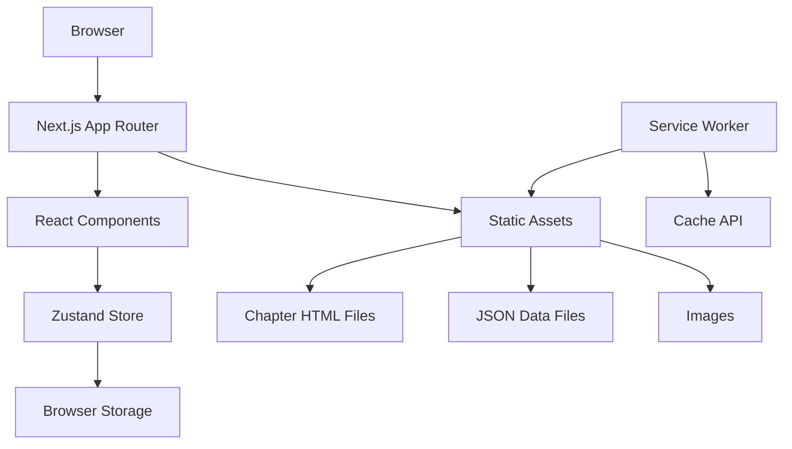

# Design Document

## Overview

The Interactive Textbook Viewer is a client-side React application built with Next.js 14 using the App Router pattern. The application follows a static-first approach with no backend dependencies, utilizing browser storage for persistence and static JSON files for data. The architecture prioritizes performance, offline capability, and accessibility while maintaining a simple deployment model.

## Architecture

### High-Level Architecture



### Technology Stack

- **Framework**: Next.js 14 with App Router and TypeScript
- **State Management**: Zustand with persist middleware
- **Rich Text Editor**: Tiptap v3 for text selection and highlighting
- **UI Components**: Radix UI primitives with Tailwind CSS
- **Testing**: Vitest + React Testing Library (unit), Cypress (e2e)
- **PWA**: next-pwa for service worker and offline functionality
- **Deployment**: Vercel static export to CDN

### Folder Structure

```
/app
  /(reader)/[chapter]/page.tsx    # Dynamic chapter pages
  /(flashcards)/page.tsx          # Flashcard review interface
  /components/                    # Reusable UI components
  /stores/                        # Zustand state stores
  /utils/                         # Utility functions
  /__tests__/                     # Test files
/public
  /data/
    chapters.json                 # Chapter metadata
    flash_stub.json              # AI response stubs
  /static-html/                   # Pre-generated chapter HTML
  /images/                        # Static images
```

## Components and Interfaces

### Core Components

#### 1. Reader Layout (`/app/(reader)/layout.tsx`)

- Provides the main reading interface structure
- Includes TOC sidebar, main content area, and AI sidekick panel
- Manages responsive layout and theme switching

#### 2. Chapter Page (`/app/(reader)/[chapter]/page.tsx`)

- Loads and displays chapter content from static HTML files
- Integrates Tiptap editor overlay for text selection
- Handles chapter navigation (prev/next)

#### 3. Highlight System

- **HighlightOverlay**: Tiptap-based text selection interface
- **HighlightMarker**: Visual representation of highlights in text
- **NotePanel**: Popup for adding/editing notes on highlights

#### 4. Flashcard System

- **FlashcardReview**: Main flashcard review interface
- **FlashcardGenerator**: Creates cards from highlights
- **LeitnerScheduler**: Manages spaced repetition logic

#### 5. AI Sidekick

- **ChatPanel**: Sidebar chat interface
- **MessageBubble**: Individual chat messages
- **AIStubService**: Handles canned responses from JSON

#### 6. Navigation

- **TOCSidebar**: Table of contents with chapter links
- **ChapterNav**: Previous/next chapter navigation
- **ProgressIndicator**: Reading progress visualization

### Component Interfaces

```typescript
// Core data types
interface Chapter {
  id: string;
  title: string;
  htmlPath: string;
  order: number;
}

interface Highlight {
  id: string;
  chapterId: string;
  start: number;
  end: number;
  color: string;
  text: string;
  note?: string;
  createdAt: number;
}

interface Flashcard {
  id: string;
  highlightId: string;
  question: string;
  answer: string;
  bucket: number;
  nextReview: number;
  createdAt: number;
}

interface AIMessage {
  id: string;
  type: 'user' | 'ai';
  content: string;
  timestamp: number;
}
```

## Data Models

### State Management with Zustand

#### Reader Store (`useReaderStore`)

```typescript
interface ReaderState {
  // Chapter data
  chapters: Chapter[];
  currentChapter: string | null;

  // Highlights and notes
  highlights: Highlight[];

  // UI state
  sidebarOpen: boolean;
  aiPanelOpen: boolean;
  theme: 'light' | 'dark';

  // Actions
  setCurrentChapter: (id: string) => void;
  addHighlight: (highlight: Highlight) => void;
  updateHighlight: (id: string, updates: Partial<Highlight>) => void;
  deleteHighlight: (id: string) => void;
  toggleSidebar: () => void;
  toggleAIPanel: () => void;
  setTheme: (theme: 'light' | 'dark') => void;
}
```

#### Flashcard Store (`useFlashcardStore`)

```typescript
interface FlashcardState {
  cards: Flashcard[];
  currentReviewSession: string[];
  sessionStats: {
    reviewed: number;
    correct: number;
    remaining: number;
  };

  // Actions
  createCard: (highlight: Highlight) => void;
  promoteCard: (id: string) => void;
  demoteCard: (id: string) => void;
  startReviewSession: () => void;
  endReviewSession: () => void;
}
```

#### AI Store (`useAIStore`)

```typescript
interface AIState {
  messages: AIMessage[];
  isLoading: boolean;
  stubData: Record<string, string>;

  // Actions
  sendMessage: (content: string) => Promise<void>;
  clearMessages: () => void;
  loadStubData: () => Promise<void>;
}
```

### Data Persistence

All stores use Zustand's persist middleware to automatically sync with localStorage:

```typescript
export const useReaderStore = create<ReaderState>()(
  persist(
    (set, get) => ({
      // store implementation
    }),
    {
      name: 'textbook-reader-store',
      storage: createJSONStorage(() => localStorage),
    },
  ),
);
```

### Static Data Structure

#### chapters.json

```json
{
  "chapters": [
    {
      "id": "chapter-1",
      "title": "Introduction to React",
      "htmlPath": "/static-html/chapter-1.html",
      "order": 1
    }
  ]
}
```

#### flash_stub.json

```json
{
  "What is React?": "React is a JavaScript library for building user interfaces...",
  "How do hooks work?": "Hooks are functions that let you use state and lifecycle features...",
  "default": "🤖 I'm still learning—check back soon!"
}
```

## Error Handling

### Client-Side Error Boundaries

- **ChapterErrorBoundary**: Handles chapter loading failures
- **HighlightErrorBoundary**: Manages highlight system errors
- **StorageErrorBoundary**: Handles localStorage/persistence failures

### Error Recovery Strategies

1. **Graceful Degradation**: If localStorage fails, continue without persistence
2. **Retry Logic**: Automatic retry for failed static asset loads
3. **Fallback Content**: Default responses when AI stub data fails
4. **User Feedback**: Toast notifications for non-critical errors

### Error Types and Handling

```typescript
interface AppError {
  type: 'storage' | 'network' | 'parsing' | 'unknown';
  message: string;
  recoverable: boolean;
  context?: Record<string, any>;
}

// Error handling utility
export const handleError = (error: AppError) => {
  if (error.recoverable) {
    // Show toast and continue
    toast.error(error.message);
  } else {
    // Show error boundary
    throw error;
  }
};
```

## Testing Strategy

### Unit Testing (Vitest + React Testing Library)

- **Store Logic**: Test all Zustand store actions and state updates
- **Utility Functions**: Test Leitner algorithm, text processing, date handling
- **Component Logic**: Test component behavior without DOM rendering
- **Target**: ≥90% coverage for functions and utilities

### Component Testing (React Testing Library)

- **User Interactions**: Test highlighting, flashcard flipping, navigation
- **State Integration**: Test component-store interactions
- **Accessibility**: Test keyboard navigation and screen reader support
- **Target**: Cover all major UI states and user flows

### End-to-End Testing (Cypress)

- **Reader Flow**: Navigate chapters, create highlights, add notes
- **Flashcard Flow**: Generate cards, review with spaced repetition
- **AI Interaction**: Send messages, receive responses
- **Offline Functionality**: Test PWA behavior and caching
- **Target**: Cover critical user journeys

### Performance Testing

- **Lighthouse CI**: Automated performance, accessibility, and PWA scoring
- **Bundle Analysis**: Monitor JavaScript bundle size and loading performance
- **Target**: PWA ≥90%, Performance ≥85%

## PWA and Offline Strategy

### Service Worker Implementation

```typescript
// Using next-pwa configuration
const withPWA = require('next-pwa')({
  dest: 'public',
  register: true,
  skipWaiting: true,
  runtimeCaching: [
    {
      urlPattern: /^https:\/\/fonts\.googleapis\.com\/.*/i,
      handler: 'CacheFirst',
      options: {
        cacheName: 'google-fonts',
        expiration: {
          maxEntries: 4,
          maxAgeSeconds: 365 * 24 * 60 * 60, // 1 year
        },
      },
    },
    {
      urlPattern: /\.(?:eot|otf|ttc|ttf|woff|woff2|font.css)$/i,
      handler: 'StaleWhileRevalidate',
      options: {
        cacheName: 'static-font-assets',
      },
    },
    {
      urlPattern: /\.(?:jpg|jpeg|gif|png|svg|ico|webp)$/i,
      handler: 'StaleWhileRevalidate',
      options: {
        cacheName: 'static-image-assets',
      },
    },
    {
      urlPattern: /\.(?:js|css)$/i,
      handler: 'StaleWhileRevalidate',
      options: {
        cacheName: 'static-resources',
      },
    },
  ],
});
```

### Caching Strategy

1. **Static Assets**: Cache HTML, CSS, JS, images with StaleWhileRevalidate
2. **Chapter Content**: Cache static HTML files on first visit
3. **JSON Data**: Cache chapters.json and flash_stub.json
4. **User Data**: Always use localStorage, no network dependency

### Installation Prompt

```typescript
// PWA install prompt component
export const InstallPrompt = () => {
  const [deferredPrompt, setDeferredPrompt] = useState<any>(null);

  useEffect(() => {
    const handler = (e: Event) => {
      e.preventDefault();
      setDeferredPrompt(e);
    };

    window.addEventListener('beforeinstallprompt', handler);
    return () => window.removeEventListener('beforeinstallprompt', handler);
  }, []);

  const handleInstall = async () => {
    if (deferredPrompt) {
      deferredPrompt.prompt();
      const { outcome } = await deferredPrompt.userChoice;
      setDeferredPrompt(null);
    }
  };

  return deferredPrompt ? (
    <Button onClick={handleInstall}>Install App</Button>
  ) : null;
};
```

## Accessibility and UX

### Accessibility Features

- **Keyboard Navigation**: Full keyboard support for all interactions
- **Screen Reader Support**: Proper ARIA labels and semantic HTML
- **Focus Management**: Logical focus order and visible focus indicators
- **Color Contrast**: WCAG AA compliant color schemes
- **Text Scaling**: Support for browser zoom up to 200%

### Dark Mode Implementation

```typescript
// Theme system using CSS variables and Tailwind
export const ThemeProvider = ({ children }: { children: React.ReactNode }) => {
  const { theme } = useReaderStore();

  useEffect(() => {
    document.documentElement.setAttribute('data-theme', theme);
  }, [theme]);

  return <div className={theme}>{children}</div>;
};
```

### Keyboard Shortcuts

- `Ctrl/Cmd + H`: Toggle highlights
- `Ctrl/Cmd + N`: Add note to selected highlight
- `Ctrl/Cmd + F`: Open flashcard review
- `Ctrl/Cmd + /`: Toggle AI sidekick
- `←/→`: Navigate between chapters
- `Escape`: Close modals/panels

## Performance Optimizations

### Code Splitting

- Route-based splitting with Next.js App Router
- Component-level splitting for heavy features (Tiptap editor)
- Dynamic imports for non-critical functionality

### Bundle Optimization

- Tree shaking for unused Radix UI components
- Selective Tiptap extension imports
- Optimized Tailwind CSS purging

### Runtime Performance

- React.memo for expensive components
- useMemo/useCallback for heavy computations
- Virtual scrolling for large chapter lists
- Debounced search and filtering

### Asset Optimization

- Next.js Image component for optimized images
- WebP format with fallbacks
- Compressed static HTML files
- Minified JSON data files
